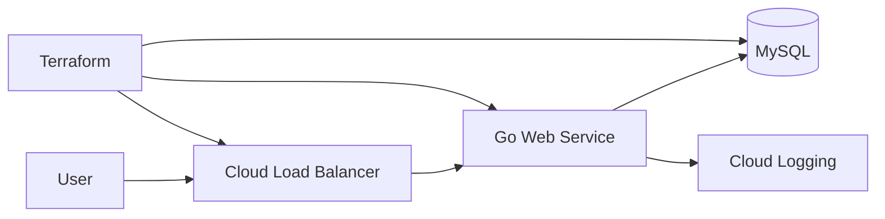
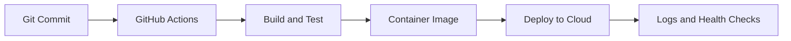

<h1 align="center">Ayush Sahu</h1>

  <strong>Cloud & DevOps Engineer | Platform Engineering</strong>

  Building reliable, highly available, and automation-friendly cloud infrastructure.

  <a href="https://www.linkedin.com/in/ayush-sahu/">LinkedIn</a> •
  <a href="mailto:ayush@ayushsahu.dev">Email</a>

---

## About

I work around cloud infrastructure, DevOps automation, and platform engineering. I enjoy building systems that make deployments smoother, infrastructure easier to manage, and services more reliable and available.

Right now, I am focused on **GCP**, **Kubernetes**, **Terraform**, **GitHub Actions**, **Go**, and infrastructure practices around **reliability**, **high availability**, and **disaster recovery**.

---

## Highlights

- Cloud infrastructure on GCP with reliability and availability in mind
- Infrastructure as Code using Terraform
- CI/CD automation with GitHub Actions
- Kubernetes, Docker, and cloud-native deployment patterns
- Go-based tooling for DevOps and platform workflows

---

## What I Can Help With

- Designing and deploying cloud infrastructure on GCP
- Improving reliability, availability, and disaster recovery readiness
- Writing Terraform modules and Infrastructure as Code workflows
- Building CI/CD pipelines with GitHub Actions
- Containerizing applications with Docker
- Learning and applying Kubernetes deployment patterns
- Creating small automation tools with Go, Python, and shell scripts

---

## Tech I Work With

- **Cloud & Infrastructure:** GCP, Kubernetes, Docker, Terraform
- **DevOps:** GitHub Actions, CI/CD, observability, Linux, Git
- **Languages:** Go, Python, Shell scripting
- **Databases:** MySQL

---

## Projects

| Project | Focus | Status |
| --- | --- | --- |
| **Three-tier GCP Web Service** | Deploying a Go web service on GCP using manual setup and Terraform | In progress |

---

## Useful Repositories

These are the types of repositories I like to keep visible because they show practical, hands-on work.

| Repository Type | What it shows |
| --- | --- |
| **Cloud deployment repos** | GCP setup, service deployment, networking, IAM, and infrastructure decisions |
| **Terraform repos** | Infrastructure as Code structure, modules, variables, outputs, and remote state usage |
| **Reliability and DR POCs** | Backup planning, recovery workflows, availability checks, and failure scenario practice |
| **GitHub Actions repos** | CI/CD pipelines, reusable workflows, custom actions, and automation patterns |
| **Kubernetes POCs** | Deployments, services, ingress, configs, secrets, and debugging notes |
| **Go automation tools** | CLI tools, task automation, file handling, and DevOps helper utilities |
| **Learning notes** | Short notes, commands, troubleshooting steps, and topic summaries |

You can also explore my public repositories here: [github.com/Sahu-Ayush?tab=repositories](https://github.com/Sahu-Ayush?tab=repositories)

---

## POCs & Learning Notes

I use small proof-of-concepts to understand tools deeply before applying them in larger projects.

| Area | What I am exploring |
| --- | --- |
| **GCP** | IAM, networking basics, compute services, and deployment flows |
| **Reliability & DR** | High availability patterns, backup planning, recovery workflows, and failure testing |
| **Terraform** | Remote state, reusable modules, variables, outputs, and environment structure |
| **Kubernetes** | Pods, deployments, services, ingress, config maps, secrets, and troubleshooting |
| **GitHub Actions** | Reusable workflows, custom actions, error handling, and CI/CD patterns |
| **Go Automation** | CLI tools, file handling, APIs, and DevOps workflow automation |

---

## Current Focus

- Building stronger fundamentals in Kubernetes networking, workloads, and deployments
- Learning practical high availability, backup, restore, and disaster recovery patterns
- Improving Terraform project structure for reusable infrastructure
- Creating GitHub Actions workflows that are easier to reuse and debug
- Practicing Go by building practical DevOps and platform tools

---

## How I Work

- I prefer simple, repeatable automation over manual steps
- I think about reliability, recovery, and operational clarity while designing infrastructure
- I like documenting setup steps so projects are easier to run later
- I try to understand the system before adding tools or abstractions
- I care about clean workflows, useful logs, and practical troubleshooting

---

## Open To

- Cloud Engineer and DevOps-focused opportunities
- Collaborating on infrastructure, automation, or platform tooling projects
- Learning from production-grade cloud-native systems
- Contributing to projects that improve developer experience

---

## Project Work & Notes

| Area | Links |
| --- | --- |
| Cloud infrastructure | [GCP repositories](https://github.com/Sahu-Ayush?tab=repositories&q=gcp) |
| Infrastructure as Code | [Terraform repositories](https://github.com/Sahu-Ayush?tab=repositories&q=terraform) |
| Container orchestration | [Kubernetes repositories](https://github.com/Sahu-Ayush?tab=repositories&q=kubernetes) |
| CI/CD automation | [GitHub Actions repositories](https://github.com/Sahu-Ayush?tab=repositories&q=github-actions) |
| DevOps tooling | [Go repositories](https://github.com/Sahu-Ayush?tab=repositories&q=go) |
| Learning notes and POCs | [Notes and POC repositories](https://github.com/Sahu-Ayush?tab=repositories&q=notes) |

### Three-tier GCP Web Service

### CI/CD Deployment Flow

## TODO

- Add real links to useful repositories
- Add 1-2 architecture diagrams for major projects
- Publish short learning notes and POCs as repositories
- Link this profile to more concrete project work

---
## GitHub Activity

  
  

  
  

  

  

  

  

