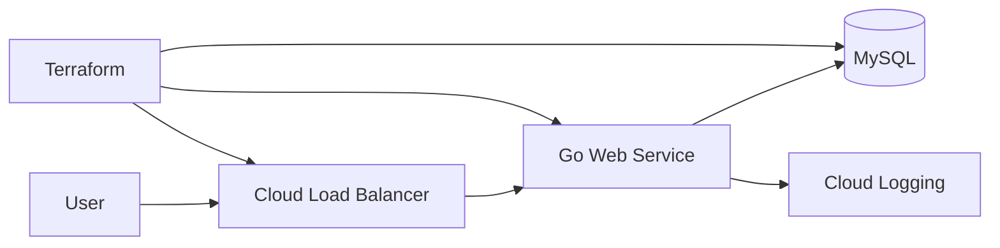
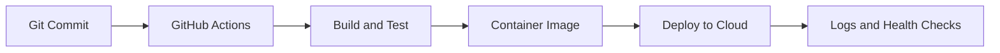

<h1 align="center">Ayush Sahu</h1>

  <strong>Cloud & DevOps Engineer | Platform Engineering | Reliability</strong>

  I build reliable, automation-friendly cloud infrastructure with a focus on GCP,
  Kubernetes, Terraform, CI/CD, and practical operational clarity.

  <a href="https://www.linkedin.com/in/ayush-sahu/">LinkedIn</a> |
  <a href="mailto:ayush@ayushsahu.dev">Email</a> |
  <a href="https://github.com/Sahu-Ayush?tab=repositories">Repositories</a>

  

---

## About Me

I work across cloud infrastructure, DevOps automation, and platform engineering. I enjoy building systems that make deployments smoother, infrastructure easier to manage, and services more reliable in day-to-day operations.

My current focus is on **GCP**, **Kubernetes**, **Terraform**, **GitHub Actions**, **Go**, and infrastructure practices around **reliability**, **high availability**, **backup/restore**, and **disaster recovery**.

---

## Core Strengths

| Area | What I Focus On |
| --- | --- |
| **Cloud Infrastructure** | GCP setup, networking basics, IAM, compute services, deployment flows, and environment design |
| **Infrastructure as Code** | Terraform modules, variables, outputs, remote state, reusable structure, and clear documentation |
| **CI/CD Automation** | GitHub Actions workflows, reusable pipelines, build/test/deploy flows, and debugging-friendly automation |
| **Cloud Native Systems** | Docker, Kubernetes workloads, services, ingress, configs, secrets, and deployment patterns |
| **Reliability Practices** | Availability checks, backup planning, recovery workflows, failure testing, and operational readiness |
| **DevOps Tooling** | Go, Python, and shell scripts for small automation tools and platform workflows |

---

## Tech Stack

  
  
  
  
  
  
  
  
  

---

## Featured Work

| Project | Focus | Status |
| --- | --- | --- |
| **Three-tier GCP Web Service** | Go web service deployment on GCP with Terraform, MySQL, logging, and deployment documentation | In progress |
| **Infrastructure & Reliability POCs** | Backup/restore flows, availability checks, Terraform structure, Kubernetes deployment patterns, and CI/CD experiments | Ongoing |
| **DevOps Automation Tools** | Small Go, Python, and shell utilities for repeatable operations and developer workflows | Ongoing |

### Three-tier GCP Web Service

### CI/CD Deployment Flow

---

## Repository Map

| Topic | Explore |
| --- | --- |
| **Cloud Infrastructure** | [GCP repositories](https://github.com/Sahu-Ayush?tab=repositories&q=gcp) |
| **Infrastructure as Code** | [Terraform repositories](https://github.com/Sahu-Ayush?tab=repositories&q=terraform) |
| **Container Orchestration** | [Kubernetes repositories](https://github.com/Sahu-Ayush?tab=repositories&q=kubernetes) |
| **CI/CD Automation** | [GitHub Actions repositories](https://github.com/Sahu-Ayush?tab=repositories&q=github-actions) |
| **DevOps Tooling** | [Go repositories](https://github.com/Sahu-Ayush?tab=repositories&q=go) |
| **Learning Notes & POCs** | [Notes and POC repositories](https://github.com/Sahu-Ayush?tab=repositories&q=notes) |

---

## Current Focus

- Strengthening Kubernetes networking, workloads, services, ingress, and troubleshooting fundamentals
- Practicing high availability, backup, restore, and disaster recovery patterns through hands-on POCs
- Improving Terraform project structure for reusable and maintainable infrastructure
- Building GitHub Actions workflows that are easier to reuse, debug, and operate
- Creating practical Go-based tools for DevOps and platform engineering workflows

---

## How I Work

- I prefer simple, repeatable automation over fragile manual steps
- I design infrastructure with reliability, recovery, and operational clarity in mind
- I document setup steps, tradeoffs, and troubleshooting notes so projects are easier to revisit
- I try to understand the system before adding tools, abstractions, or extra moving parts
- I care about clean workflows, useful logs, readable code, and practical failure handling

---

## Open To

- Cloud Engineer and DevOps-focused opportunities
- Collaborating on infrastructure, automation, or platform tooling projects
- Learning from production-grade cloud-native systems
- Contributing to projects that improve developer experience and operational reliability

---

## GitHub Activity

  
  

  
  

  

